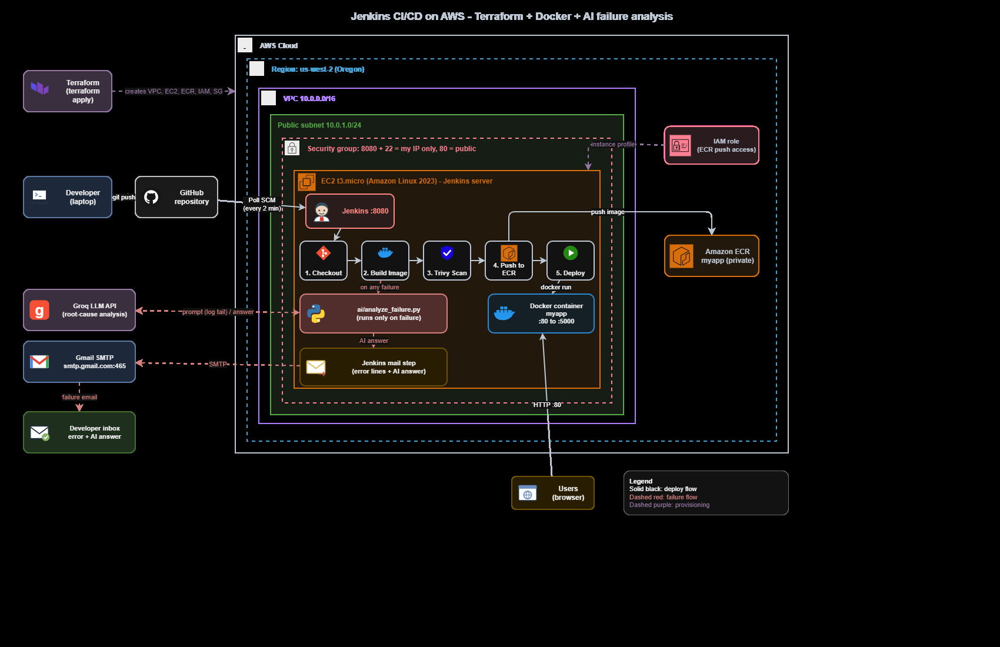
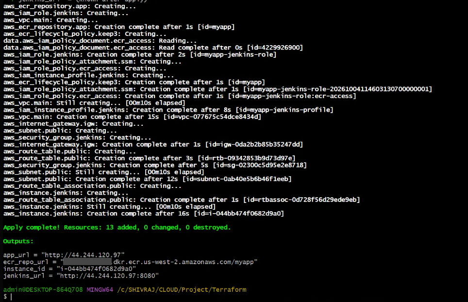
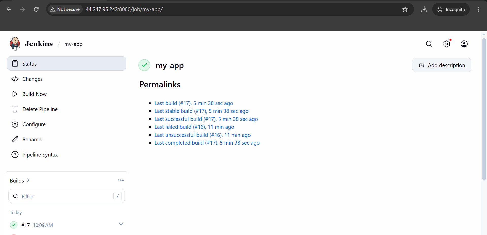
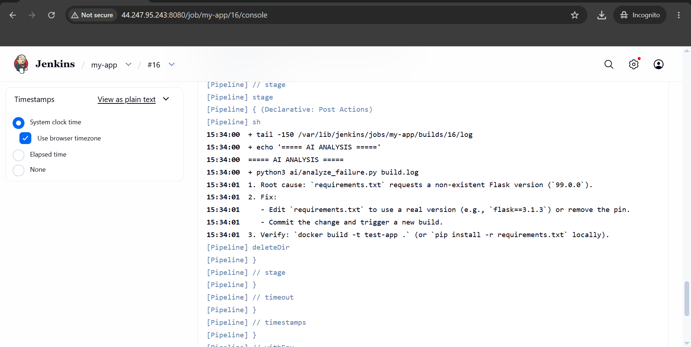
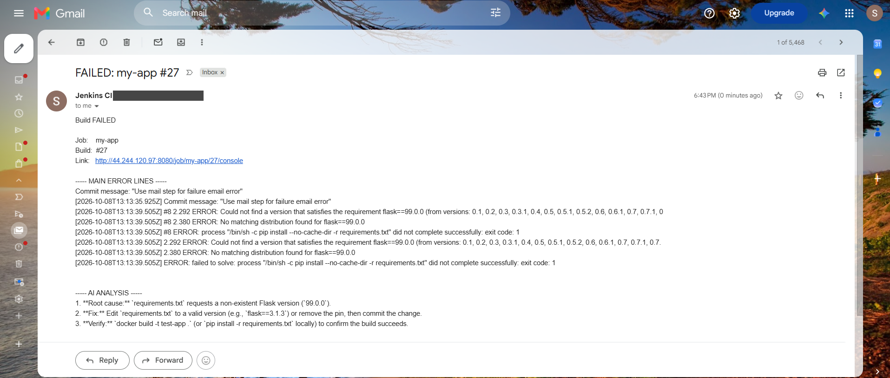
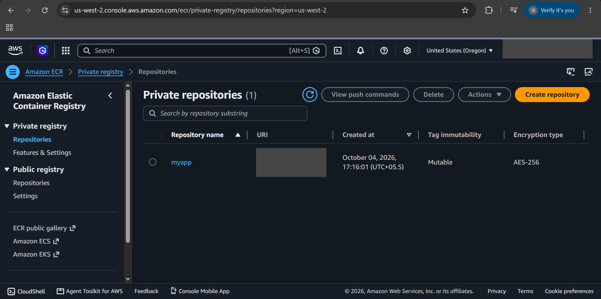
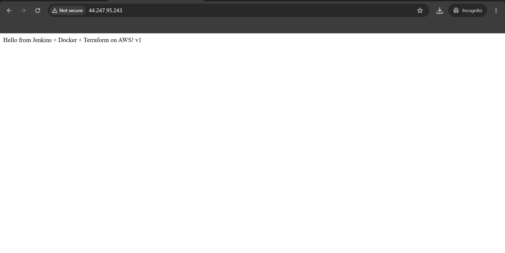
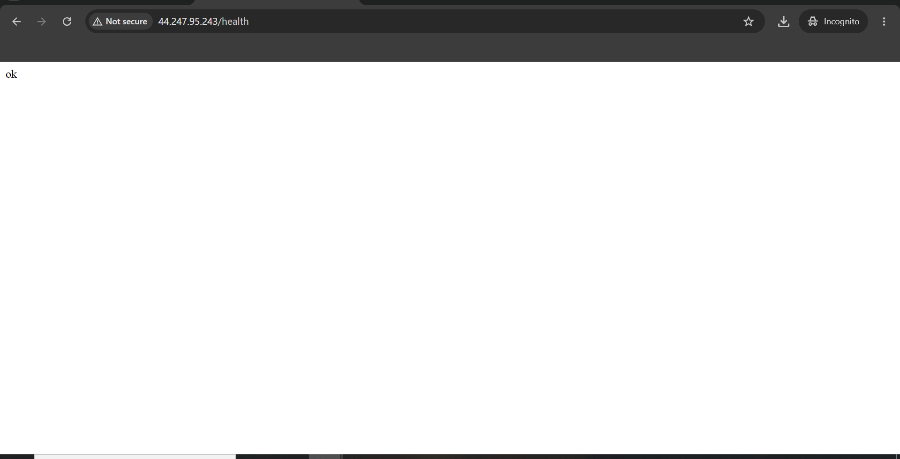

<div align="center">

# 🚀 Jenkins CI/CD on AWS With AI-powered failure analysis
### Terraform · Docker · Trivy · AI-powered failure analysis

*Push code → Jenkins builds, scans and deploys it. Break something → an AI reads the log and emails you the root cause and the fix.*


</div>

---

## 📌 Overview

A complete DevOps project that runs on the **AWS free tier** (one `t3.micro`, no NAT gateway, no load balancer).

- 🏗️ **Terraform** creates the whole infrastructure: VPC, subnet, internet gateway, security group, IAM role, ECR and the Jenkins EC2 server (13 resources).
- ⚙️ **Jenkins** (installed automatically on the EC2) builds a Docker image on every commit, scans it with **Trivy**, pushes it to **Amazon ECR** and deploys it.
- 🤖 When a build fails, an **LLM (Groq)** analyses the log and Jenkins **emails the error lines together with the AI's root cause, fix and verification command**.

## 🏛️ Architecture

<p align="center">
  
</p>

## ✨ Features

| | Feature | Details |
|---|---|---|
| 🏗️ | **Infrastructure as Code** | One `terraform apply` creates everything, `terraform destroy` removes it |
| 🔁 | **Automated CI/CD** | Jenkins polls GitHub and runs the pipeline on every commit |
| 🐳 | **Containerised app** | Docker image stored in a private ECR repository, tagged with the build number |
| 🛡️ | **Security scan** | Trivy reports HIGH and CRITICAL vulnerabilities in every image |
| 🔐 | **No stored AWS keys** | Jenkins uses an IAM instance role limited to this ECR repository |
| 🤖 | **AI root-cause analysis** | Failed build log → LLM → root cause, fix and verify command |
| 📧 | **Failure email** | Error lines + AI answer + link to the build console |
| 🧯 | **Resilient AI step** | Retries, several model fallbacks and a rule-based fallback if the AI API is down |
| 💸 | **Cost aware** | Single `t3.micro`, ECR lifecycle policy keeps only the last 3 images |

## 🔄 Pipeline stages

| # | Stage | What happens |
|---|---|---|
| 1 | **Checkout** | Pull the latest commit from GitHub |
| 2 | **Build Image** | `docker build` of the Flask app |
| 3 | **Security Scan** | Trivy scans the image (HIGH and CRITICAL, reporting only) |
| 4 | **Push to ECR** | Log in with the IAM role and push tag `<build number>` |
| 5 | **Deploy** | Replace the running container, then check `/health` |
| ⚠️ | **On failure** | Run the AI analyzer → send the failure email |

## 📸 Screenshots

### 1. Infrastructure created by Terraform
> `Apply complete! Resources: 13 added`

<p align="center"></p>

### 2. Jenkins pipeline: green build after a failed one
<p align="center"></p>

### 3. AI analysis printed in the Jenkins console (build #16 failed on purpose)
<p align="center"></p>

### 4. Failure email with the error lines and the AI answer
<p align="center"></p>

### 5. Image stored in Amazon ECR
<p align="center"></p>

### 6. The deployed application
<table>
  <tr>
    <td align="center"><b>Home page</b><br></td>
    <td align="center"><b>/health endpoint</b><br></td>
  </tr>
</table>

## 🤖 How the AI failure analyzer works

```
Build fails
   │
   ├─► last lines of the log are collected
   ├─► ai/analyze_failure.py sends them to the Groq API
   │       • tries several models, retries on 429 / 5xx / timeouts
   │       • if the AI is unreachable → rule-based hint instead
   ├─► answer = root cause + fix + command to verify
   └─► Jenkins `mail` step sends: build link + main error lines + AI answer
```

Example answer from build #16:

```
1. Root cause: requirements.txt requests a non-existent Flask version (99.0.0).
2. Fix: Edit requirements.txt to use a real version, commit and trigger a new build.
3. Verify: docker build -t test-app .
```

## 📁 Repository structure

```
.
├── Terraform/
│   ├── main.tf               # VPC, subnet, IGW, SG, IAM, ECR, EC2
│   ├── variables.tf
│   ├── outputs.tf
│   └── jenkins/
│       └── install-jenkins.sh    # EC2 user_data: swap, Docker, Java, Jenkins, Trivy
├── app/
│   ├── app.py                # Flask app (/ and /health)
│   ├── requirements.txt
│   └── Dockerfile
├── ai/
│   └── analyze_failure.py    # LLM-based build failure analyzer
├── docs/                     # Architecture diagram and screenshots
├── Jenkinsfile               # Pipeline as code
└── README.md
```

## 🛠️ Getting started

**Prerequisites:** AWS account, AWS CLI configured, Terraform 1.10+, an EC2 key pair in `us-west-2`, a [Groq](https://console.groq.com) API key and a Gmail app password.

```bash
# 1. Clone
git clone https://github.com/ShivrajKale1223/jenkins-cicd-terraform-docker-ai.git
cd jenkins-cicd-terraform-docker-ai/Terraform

# 2. Allow only your IP to reach Jenkins and SSH
echo 'my_ip = "YOUR.PUBLIC.IP/32"' > terraform.tfvars

# 3. Create the infrastructure
terraform init
terraform apply
```

Then in Jenkins (`jenkins_url` output, port 8080):

1. Unlock Jenkins: `sudo cat /var/lib/jenkins/secrets/initialAdminPassword` on the server.
2. Install the plugins: Pipeline, Git, GitHub, Docker Pipeline, Timestamper.
3. Add a **Secret text** credential with ID `AI_API_KEY` (your Groq key).
4. Add the global environment variable `ALERT_EMAIL` (**Manage Jenkins → System**) and configure Gmail SMTP under *E-mail Notification*.
5. Create a **Pipeline** job from SCM: this repository, branch `main`, script path `Jenkinsfile`, trigger *Poll SCM* `H/2 * * * *`.
6. Push a commit and watch the pipeline run. To test the AI, put `flask==99.0.0` in `app/requirements.txt` and push.

When you are done, remove everything so nothing keeps billing:

```bash
terraform destroy
```

## 🔒 Security

- No AWS access keys anywhere. Jenkins uses an **IAM instance role** limited to the ECR repository.
- Jenkins (8080) and SSH (22) are open to **one IP only**. Only port 80 is public.
- IMDSv2 is enforced and the root volume is encrypted.
- Secrets (AI key, SMTP password, alert address) live in Jenkins and never in Git. `*.tfvars`, `*.tfstate` and `*.pem` are in `.gitignore`.

## 🧠 Lessons learned

- 🔧 A hard-coded tool version URL (Trivy) stopped the bootstrap script before Jenkins started. Use install scripts and never let a non-critical step block the main service.
- ☕ The current Jenkins release needs **Java 21**, and its built-in node went offline because `/tmp` on a 1 GB instance is tiny.
- 🧹 Post-build cleanup must run **last** (`cleanup`), otherwise it deletes the files the failure handler needs.
- 🌐 Free LLM tiers change model names and can be slow or overloaded. The analyzer needs retries, model fallbacks and a rule-based fallback.
- ✉️ Jenkins' plain `mail` step worked where `emailext` did not, because it used the SMTP settings that were already tested.
- 🔌 A notification path should never depend on one external service.

## 🗺️ Roadmap

- [ ] Fail the build when Trivy finds CRITICAL vulnerabilities
- [ ] Add a unit-test stage before the image build
- [ ] Remote Terraform state in S3 with locking
- [ ] GitHub webhook instead of polling
- [ ] Application Load Balancer + ECS Fargate for the app
- [ ] HTTPS and a custom domain
- [ ] Slack notifications

## 👤 Author

**Shivraj Kale**
GitHub: [@ShivrajKale1223](https://github.com/ShivrajKale1223)

---

<div align="center">⭐ If this project helped you, consider giving it a star.</div>
